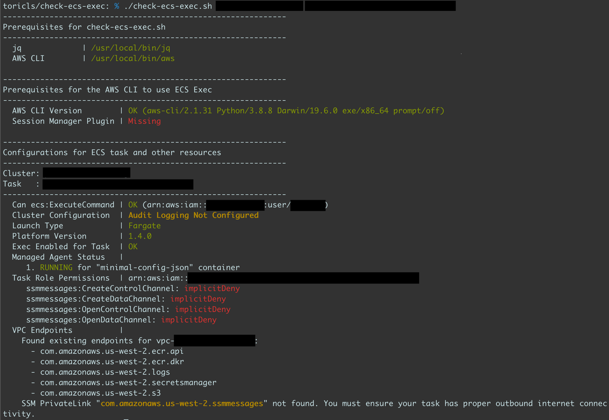

# Amazon ECS Exec Checker

The `check-ecs-exec.sh` script allows you to check and validate both your CLI environment and ECS cluster/task are ready for `ECS Exec`, by calling [various AWS APIs](check-ecs-exec.sh#L21) on behalf of you. You can learn more about ECS Exec on [the containers blog post](https://aws.amazon.com/blogs/containers/new-using-amazon-ecs-exec-access-your-containers-fargate-ec2/) and [the official developer guide](https://docs.aws.amazon.com/AmazonECS/latest/developerguide/ecs-exec.html).


## Prerequisites

The `check-ecs-exec.sh` requires the following commands.

- jq
- AWS CLI v1.19.28/v2.1.30 or later

## Usage

```shell
$ ./check-ecs-exec.sh <YOUR_ECS_CLUSTER_NAME> <YOUR_ECS_TASK_ID>
```

_Example 1 - Run without cloning Git repo_

The `check-ecs-exec.sh` will use your `default` AWS CLI profile and the AWS region.

```shell
$ bash <( curl -Ls https://raw.githubusercontent.com/aws-containers/amazon-ecs-exec-checker/main/check-ecs-exec.sh ) <YOUR_ECS_CLUSTER_NAME> <YOUR_ECS_TASK_ID>
```

_Example 2 - With AWS\_* variables_

The `check-ecs-exec.sh` will use the `myprofile` AWS CLI profile and `us-west-2` AWS region.

```shell
$ export AWS_PROFILE=myprofile
$ export AWS_REGION=us-west-2

$ bash <( curl -Ls https://raw.githubusercontent.com/aws-containers/amazon-ecs-exec-checker/main/check-ecs-exec.sh ) <YOUR_ECS_CLUSTER_NAME> <YOUR_ECS_TASK_ID>
```

_Example 3 - Switch AWS CLI binaries_

If you have multiple AWS CLI installations in your environment, both AWS CLI v1 and v2 for example, you can choose which AWS CLI binary to use by passing the `AWS_CLI_BIN` env variable.

```shell
$ AWS_CLI_BIN=aws-v1 ./check-ecs-exec.sh <YOUR_ECS_CLUSTER_NAME> <YOUR_ECS_TASK_ID>
```

## Checks

The `check-ecs-exec.sh` shows the results with three text colors, 🟢(Green), 🟡(Yellow), and 🔴(Red). Each color tells how you'll handle the results.

1. 🟢(Green) - The configuration or the status is okay.
2. 🟡(Yellow) - The configuration or the status should or would be recommended to fix, but you can use ECS Exec without fixing them.
3. 🔴(Red) - You need to fix those results before using ECS Exec.

In the following screenshot for instance, we need to install the Session Manager plugin and give required permissions to the task role at least, but we can ignore the audit-logging configuration.

Note that it shows "SSM PrivateLink" at the bottom as a 🟡(yellow) result, but it can be a 🔴(red) result if your ECS task doesn't have proper outbound internet connectivity. In this case, you will need to configure an [SSM PrivateLink](https://docs.aws.amazon.com/vpc/latest/privatelink/vpce-interface.html#create-interface-endpoint) in your VPC.

[](example-result.png)

## Reference - How to handle 🔴(Red) items

1. **_Pre-flight check failed: `jq` command is missing_**  
Install the `jq` command. See [the official documentation](https://stedolan.github.io/jq/download/) for the details and how to install.

2. **_Pre-flight check failed: `aws` command is missing_**  
Install the latest AWS CLI. See [the official documentation for the AWS CLI v2](https://docs.aws.amazon.com/cli/latest/userguide/install-cliv2.html) or [the official documentation for the AWS CLI v1](https://docs.aws.amazon.com/cli/latest/userguide/install-cliv1.html) for the details and how to install.

3. **_Pre-flight check failed: ECS Exec requires the AWS CLI v1.19.28/v2.1.30 or later_**  
Upgrade to the latest AWS CLI. See [the official documentation for the AWS CLI v2](https://docs.aws.amazon.com/cli/latest/userguide/install-cliv2.html) or [the official documentation for the AWS CLI v1](https://docs.aws.amazon.com/cli/latest/userguide/install-cliv1.html) for the details and how to upgrade.

4. **_Session Manager Plugin | Missing_**  
Install the Session Manager plugin. See [the official documentation](https://docs.aws.amazon.com/systems-manager/latest/userguide/session-manager-working-with-install-plugin.html) for the details and how to install.

5. **_Can I ExecuteCommand? | ecs:ExecuteCommand: implicitDeny_**  
The IAM user/role you used for the `check-ecs-exec.sh` are not allowed to use the `ecs:ExecuteCommand` API. See the "[Using IAM policies to limit access to ECS Exec](https://docs.aws.amazon.com/AmazonECS/latest/developerguide/ecs-exec.html#ecs-exec-best-practices-limit-access-execute-command) section in the official documenation to add the required permission to the IAM user/role.

6. **_Can I ExecuteCommand? | kms:GenerateDataKey: implicitDeny_**  
The IAM user/role you used for the `check-ecs-exec.sh` are not allowed to use the `kms:GenerateDataKey` API with the given KMS Key ID which you're using for the logging and auditing configuration for ECS exec. See the "[IAM permissions required for encryption using your own KMS customer master key (CMK)](https://docs.aws.amazon.com/AmazonECS/latest/developerguide/ecs-exec.html#ecs-exec-logging) section under the "Logging and Auditing using ECS Exec" section in the official documenation to add the required permission to the IAM user/role.

7. **_Platform Version | 1.3.0 (Required: >= 1.4.0)_**  
On AWS Fargate, `ECS Exec` requires the Platform version 1.4.0 or newer. If your ECS task is part of an ECS service, then you can update the platform version by specifying the `PlatformVersion` parameter for the `UpdateService` API. If your ECS task is a standalone task, then you need to re-run the ECS task with the `PlatformVersion` parameter specified for the `RunTask` API. See also [the migration guide from the previous PVs](https://docs.aws.amazon.com/AmazonECS/latest/developerguide/platform_versions.html#platform-version-migration).

8. **_ECS Agent Version | x.y.z (Required: >= 1.50.2)_**  
You need to update the version of the ECS Container Agent for your EC2 instance where your ECS task runs. See [the official documentation](https://docs.aws.amazon.com/AmazonECS/latest/developerguide/ecs-agent-update.html) for the details and how to update.

9. **_Exec Enabled for Task | NO_**  
You need to enable the ECS Exec feature for your ECS service or your ECS standalone task. If your ECS task is part of an ECS service, then you can update the ECS by specifying the `EnableExecuteCommand` parameter for the `UpdateService` API. If your ECS task is a standalone task, then you need to re-run the ECS task with the `EnableExecuteCommand` parameter specified for the `RunTask` API.

10. **_Managed Agent Status | STOPPED (Reason: stopped-reason-here)_**  
The managed agent for a container in your Task has stopped for some reasons. If you see this error again and again even after re-running your ECS task, then make sure you have other results from `check-ecs-exec.sh` are all green.

11. **_EC2 or Task Role | Not Configured"_ or _{serviceName}:{ActionName}: implicitDeny_**  
Your ECS task needs a task role or an instance role of the underlying EC2 instance with some permissions for using SSM Session Manager at least. See the [IAM permissions required for ECS Exec](https://docs.aws.amazon.com/AmazonECS/latest/developerguide/ecs-exec.html#ecs-exec-enabling-and-using) section and the [Enabling logging and auditing in your tasks and services](https://docs.aws.amazon.com/AmazonECS/latest/developerguide/ecs-exec.html#ecs-exec-logging) section in the official documentation for the details.

12. **_SSM PrivateLink "com.amazonaws.(region).ssmmessages" not found_**  
The `check-ecs-exec.sh` found one or more VPC endpoints configured in the VPC for your task, so you **may** want to add an additional SSM PrivateLink for your VPC. Make sure your ECS task has proper outbound internet connectivity, and if it doesn't, then you **need** to configure an additional SSM PrivateLink for your VPC.

## Security

See [CONTRIBUTING](CONTRIBUTING.md#security-issue-notifications) for more information.

## License

Licensed under the MIT-0 License. See the [LICENSE](LICENSE) file.
